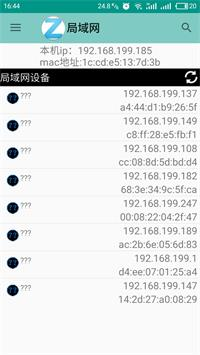

# MyApp
简单的app，局域网聊天。
 
实现的功能： 
        1.局域网内所有设备的ip及Mac地址。
        2.简单的局域网内文字聊天，发送图片。
        3.简陋的txt文本书籍阅读。

        使用的一些开源库
        >* universal-image-loader 本地图片浏览的加载
        >* chardet.jar 获取文件txt文件编码的解析
        >*。。。
        support:design

        主界面
 
        Drawlayout布局实现侧滑菜单，Bottom navigation作为底部导航栏 
         
        
        通过UDP、Tcp协议局域网内存活的设备信息（IP及Mac地址） 
        
          
        聊天文字和图片的发送用TCP 协议，NIO方式ServerSocketChannel和SocketChannel采用非阻塞方式注册到Selector，单个线程处理网络IO
        聊天记录保存通过数据库保存在本地，通过一个唯一id作为身份识别。 
        
        
         
        
         简陋的书籍阅读，通过数据库将阅读进度等读书信息保存

